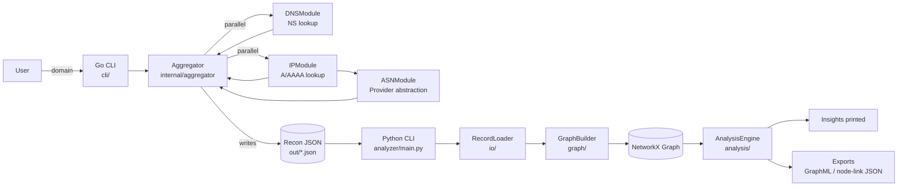
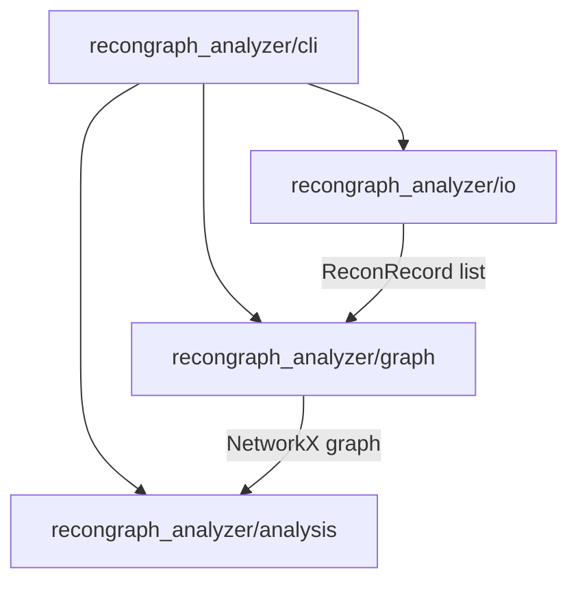

# ReconGraph (MVP)

Production-grade starter MVP that:
- Takes a domain input
- Collects DNS NS + IPs via a Go recon engine (parallel modules)
- Resolves a representative ASN via an abstraction (mock provider in MVP)
- Emits a stable JSON contract
- Builds/analyzes an infrastructure dependency graph in Python (NetworkX)

## Architecture (Mermaid)

### End-to-end flow



### Python package layering (OOP)



### Go design patterns (how it works)

```mermaid
flowchart TB
  subgraph API[Core abstractions (Clean Architecture)]
    RM[ReconModule interface<br/>internal/recon/module.go<br/><br/>Name() string<br/>Run(ctx, domain) (any, error)]
    MR[ModuleResult / ResultEnvelope<br/>internal/recon + internal/aggregator]
  end

  subgraph STRAT[Strategy implementations (modules)]
    DNS[DNSModule<br/>internal/modules<br/>returns DNSResult]
    IP[IPModule<br/>internal/modules<br/>returns IPResult]
    ASN[ASNModule<br/>internal/modules<br/>returns ASNResult]
  end

  subgraph DI[Dependency Inversion (ports/adapters)]
    RES[net.Resolver<br/>(adapter)]
    AP[ASNProvider interface<br/>(port)]
    MOCK[MockASNProvider<br/>internal/modules]
  end

  subgraph ORCH[Orchestration (use-case)]
    AGG[Aggregator.Collect()<br/>internal/aggregator]
    FACT[Module wiring "factory"<br/>(creates []ReconModule)]
    CH[(resultsCh chan ResultEnvelope)]
  end

  subgraph FLOW[Runtime flow]
    PAR[goroutines run modules in parallel]
    MERGE[Aggregator merges typed results<br/>DNSResult + IPResult]
    DEP[ASN runs after IPs exist<br/>(dependency)]
    OUT[models.ReconOutput -> JSON]
  end

  %% relationships
  FACT -->|creates| DNS
  FACT -->|creates| IP
  AGG --> FACT

  DNS -. implements .-> RM
  IP -. implements .-> RM
  ASN -. implements .-> RM

  DNS -->|uses| RES
  IP -->|uses| RES
  ASN -->|uses| AP
  MOCK -. implements .-> AP

  AGG --> PAR --> CH
  DNS -->|ResultEnvelope{module,value,err}| CH
  IP -->|ResultEnvelope{module,value,err}| CH
  CH --> MERGE --> DEP --> OUT
```

## Repo layout

### Go (recon engine)
- `cli/main.go`: CLI entrypoint
- `internal/recon`: domain-level interfaces (Strategy)
- `internal/modules`: concrete recon modules (DNS/IP/ASN)
- `internal/aggregator.go`: orchestration + JSON contract assembly
- `pkg/models`: cross-layer JSON model

### Python (graph analyzer)
- `analyzer/main.py`: thin entrypoint wrapper
- `analyzer/recongraph_analyzer/io/record_loader.py`: record loading + normalization
- `analyzer/recongraph_analyzer/graph/builder.py`: OOP graph construction + shared-dependency ranking
- `analyzer/recongraph_analyzer/analysis/engine.py`: OOP analysis + insights printing
- `analyzer/recongraph_analyzer/cli/main.py`: OOP CLI wiring

## Run end-to-end

### 1) Run recon (Go) → JSON

From repo root:

```powershell
go run .\cli\ -domain example.com
```

This prints the output path (default: `out/<domain>.json`).

Optional flags:

```powershell
go run .\cli\ -domain example.com -out out\example.com.json -timeout 15s -asn-provider mock -pretty=true
```

### 2) Analyze (Python) → insights + optional exports

From repo root:

```powershell
python -m venv .venv
.\.venv\Scripts\pip install -r .\analyzer\requirements.txt
.\.venv\Scripts\python .\analyzer\main.py --input .\out\example.com.json --graph-json .\out\graph.json --graphml .\out\graph.graphml
```

You can also analyze a directory of JSON files:

```powershell
.\.venv\Scripts\python .\analyzer\main.py --input .\out\
```
